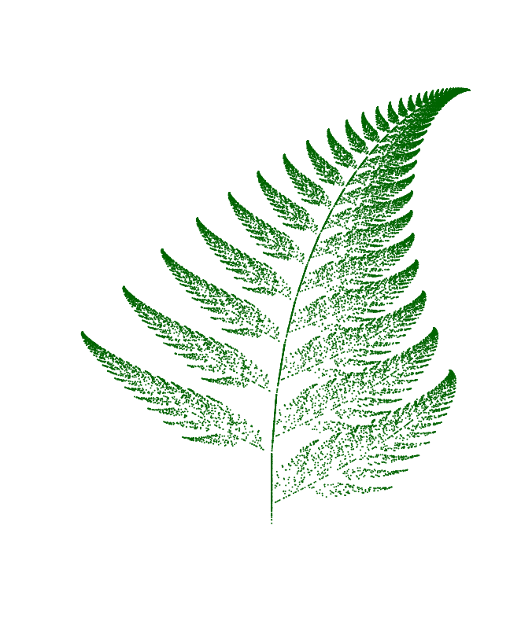
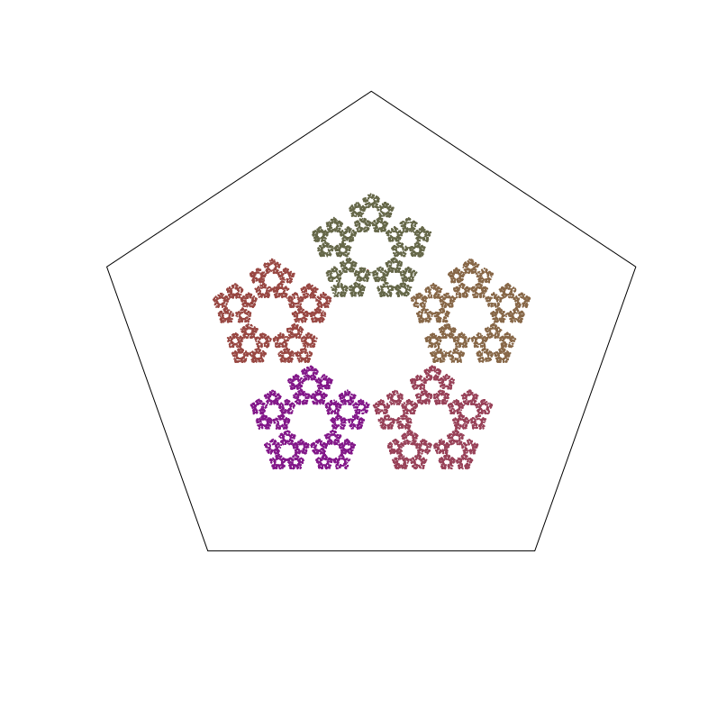
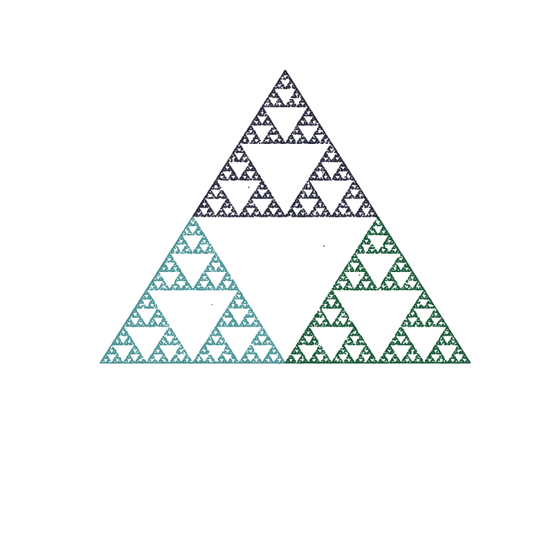
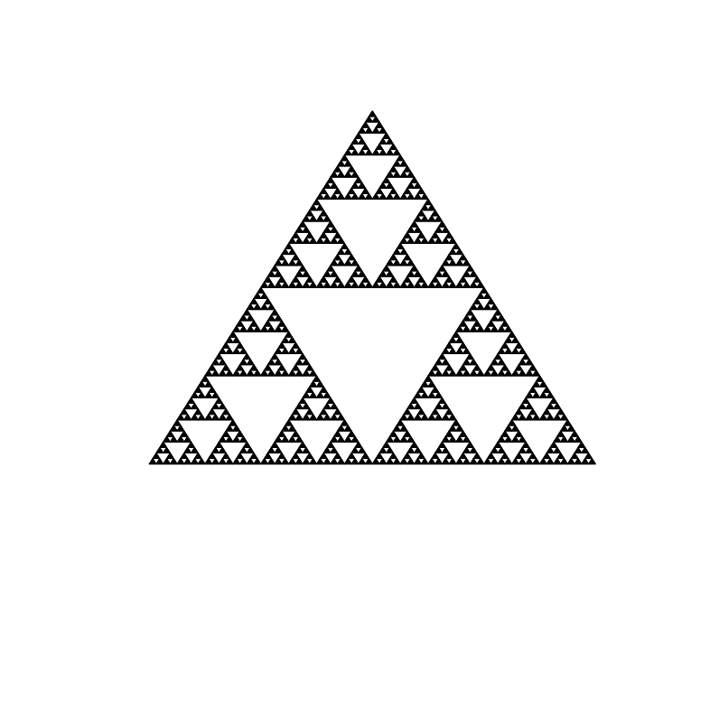
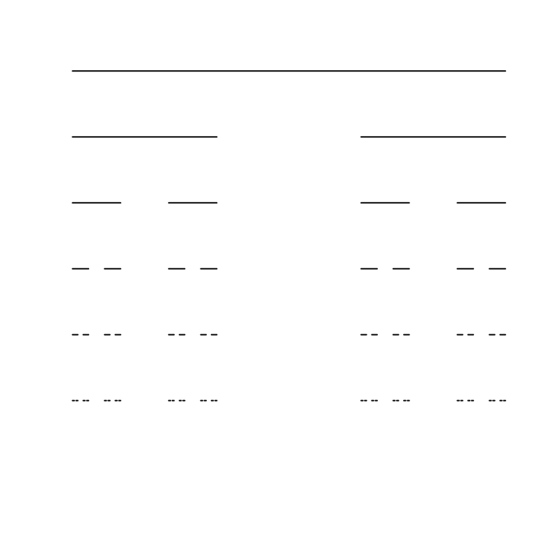
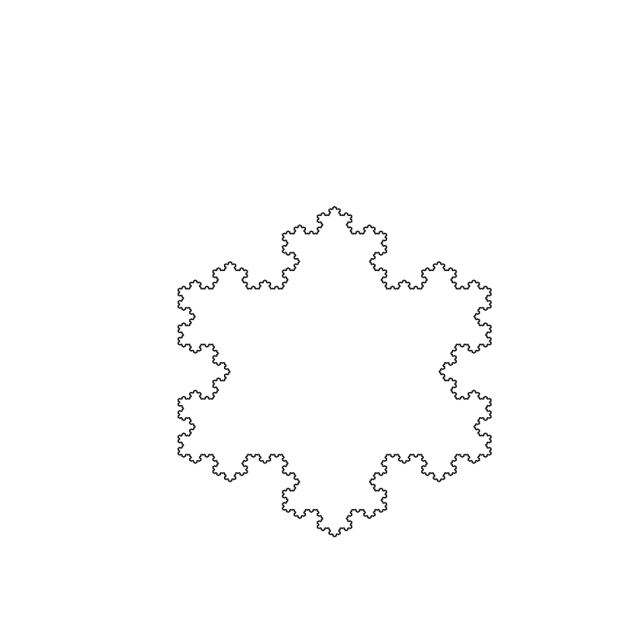

# fractalr
Package to study and plot fractals. Some examples:
##### Barnsley Fern
`> fractalr::barnsleyfern(30000)`

##### Chaos Game (5 points)
`> fractalr::chaosgame(max=20000, n=5, r=3/8)`

##### Chaos Game (3 points)
`> fractalr::chaosgame(max=20000, n=3, r=.5)`

##### Dragon Curve
`> fractalr::dragoncurve(12)`

##### Sierpinski Triangle
`> fractalr::sierpinski(6)`

##### Cantor Set
`> fractalr::cantorset(n=6)`

##### Koch Snowflake
`> fractalr::kochstar(6)`

