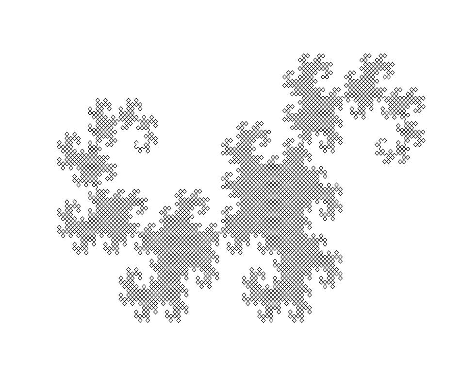

# fractalr
A R package to study and plot fractals. 

## Overview

fractalr is a package to plot and work with fractals in R, providing customizate, simple and beautiful graphs.

  - `barnsleyfern()` plots a famous Barnsley Fern fractal.
  - `chaosgame()` provide customizate Chaos Game results.
  - `dragoncurve()` plots the Dragon Curve.
  - `sierpinski()` plots a Sierpinski Triangle with variable levels.
  - `cantorset()` plots simple Cantor Set.
  - `kochstar()` plots a Koch Star or Koch Snowflake with variable levels.

## Installation

``` r
# Install devtools package:
install.packages("devtools")

# Install fractalr from github repository:
devtools::install_github("igorcav/fractalr").
```

## Cheatsheet





## Usage

``` r
library(fractalr)
r
# Barnsley Fern
barnsleyfern(30000)

# Chaos Game (5 points)
chaosgame(max=20000, n=5, r=3/8)

# Chaos Game (3 points)
chaosgame(max=20000, n=3, r=.5)

# Dragon Curve
dragoncurve(12)

# Sierpinski Triangle
sierpinski(6)

# Cantor Set
cantorset(n=6)

# Koch Snowflake
kochstar(6)

```
